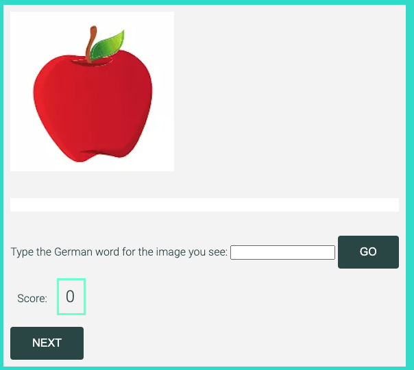

# MEGAWORTEN

Mega Worten is a German language learning game, aimed at absolute beginners, gradually improving to more advanced levels. 

Mega Worten's objective is to expand the vocabulary of the student, teach the correct spelling and appropriate noun genders of the words while learning, and through repetition and using visual memory, create a lasting knowledge of German language. 

Gamification has become a vital part of learning over the last decades as it stimulates engagement, memory, improved retention of knowledge, while offering an element of fun. Mega Worten utilises all these elements while offering a fun and stimulating game with increasing engagement. 

Mega Worten offers huge potential to grow as increasing levels of difficulty can be added, with challenges to include decreasing time limits, and competing with friends in real time. The game is age-agnostic as it's full of colourful images that can appeal to school children, as well as teens and adults. 

Mega Worten

## UX

Mega Worten game is based on a minimalistic flow. The player follows these basic steps:
- Start the game
- See an image, enter the German word
- If it's correct, earn more points
- Move to the next image and continue until there are no more images left in the game

Game Flow

### Colour Scheme

Mega Worten's colour scheme is based on a minimalistic and calming theme. The blue colour and its different shades such as turquoise, aquamarine and so on are associared with feelings of calmness and relaxation and is often described as peaceful, tranquil, secure, and orderly. Blue is seen as a sign of stability and reliability.

Mega Worten has used this colour scheme even though it is a game but its main purpose is educational and requires the mind to be open to learning, as opposed to the more stressful sensation in competitive gaming. 

- `#turquoise`  used for background colour
- `#whitesmoke` used for game area background
- `#2f4f4f`     used for H1 text
- `#1ab5db`     used for button background
- `#aquamarine` used for displayed score

Colour Scheme

I used [coolors.co](https://coolors.co/40e0d0-f5f5f5-2f4f4f-1ab5db-7fffd4) to generate my colour palette.

### Typography

- [Google Pairing](https://www.fontpair.co/pairings/roboto-condensed-roboto) suggestion was used to pair Roboto and Roboto Condensed fonts 

- [Roboto Condensed](https://fonts.google.com/specimen/Roboto+Condensed) was used for the primary headers and titles.

- [Roboto](https://fonts.google.com/specimen/Roboto) was used for all other secondary text.

- [Font Awesome](https://fontawesome.com) icons were used in the game, when displaying game messages and important game rules, as well as social media icons in the footer. 

## Wireframes

I used [Balsamiq](https://balsamiq.com/wireframes) to design my site wireframes.

| Size | Screenshot |
| --- | --- |
| Mobile |  |
| Tablet |  |
| Desktop |  |

## Features

### Existing Features

- **Feature #1**
    - Show a random picture from the array of 20 pictures. Next to the picture, show a text input field and a "GO" button for the user. Wait for the user input. 
    - 

- **Feature #2**
    - User sees the picture, enters the word for the picture in the input field, and clicks the GO button. 
    - When GO button is clicked, check if the word entered by the user is the same as the word assigned to the image. 
    - If it's the same, then user answer is correct. If it's not, then user answer is wrong.
    - 
    - 

- **Feature #3**
    - User score is zero at the start. For each correct answer, increase score by one.
    - 
    - 

- **Feature #4**
    - When user clicks the NEXT button, display a new random image from the array and repeat the same loop from the beginning. 
    - When there are no more images left to show, display message to the user "Congrats, you completed the game!" and display a button that says "NEW GAME".
    - 

- **Feature #5**
    - If user clicks the NEW GAME button, reload the full 20 images and restart the game from the beginning. 
    - 

### Future Features

- **Future Feature #1**
    - Game Timer - A countdown can be added to limit the time that the player has in order to complete all images. If the player doesn't answer all images in the array within 60 seconds, game would be over. This would add additional excitement to the game. 

- **Future Feature #2** 
    - Game Levels and Rewards - Completing the full image array can earn a reward for the player, such as digital badges and icons. 

- **Future Feature #3**
    - Additional Game Arrays  - An additional collection of images can be unlocked with each new level (days, months, seasons, numbers, foods, drinks, transport vehicles, colours, clothes, body, nature, and many more). This would increase the vocabulary and the game engagement. 

- **Future Feature #4**
    - Login and Save Scores - Player can choose to register and login in order to sva their progress and scores, as well as new badges and awards. 
 
- **Future Feature #5**
    - Challenges - New challenges can be introduced to increase the game difficulty. For example, timer can be reduced with each new level and the score to earn could be higher at higher levels. 

- **Future Feature #6**
    - Play Live Against Real People - Player can play in a race against other live players. if Player A completes the game before Player B, Player A can earn a bonus score.

- **Future Feature #7** 
    - Artificial Intelligence - New learning capability can be used to follow trending popular culture topics and create word categories using the most frequently used words (perhaps using chatGPT)
 
## Tools & Technologies Used

- [HTML](https://en.wikipedia.org/wiki/HTML) used for the main site content.
- [CSS](https://en.wikipedia.org/wiki/CSS) used for the main site design and layout.
- [CSS Grid](https://www.w3schools.com/css/css_grid.asp) used for an enhanced responsive layout.
- [JavaScript](https://www.javascript.com) used for user interaction on the site.
- [Git](https://git-scm.com) used for version control. (`git add`, `git commit`, `git push`)
- [GitHub](https://github.com) used for secure online code storage.
- [GitHub Pages](https://pages.github.com) used for hosting the deployed front-end site.
- [Gitpod](https://gitpod.io) used as a cloud-based IDE for development.
- [Markdown Builder by Tim Nelson](https://traveltimn.github.io/markdown-builder) used to help generate the Markdown files.
- [Canva](https://www.canva.com) used to design logo, favicon and default image.
- [Lucid](https://lucid.app) used to create the game flow diagram.
- [Balsamiq](https://balsamiq.cloud/) used to create wireframes.

# Testing

## Code Validation

### HTML

I have used the recommended [HTML W3C Validator](https://validator.w3.org) to validate all of my HTML files.

| File | Test Result URL | Screenshot | Notes |
| --- | --- | --- | --- |
| index.html | [W3C](https://validator.w3.org/nu/?showsource=yes&showoutline=yes&showimagereport=yes&doc=https%3A%2F%2Fshadeofpurple79.github.io%2Fmegaworten%2F#l43c86) |  | Pass: No Errors |

### CSS

I have used the recommended [CSS Jigsaw Validator](https://jigsaw.w3.org/css-validator) to validate all of my CSS files.

| File | Test Result URL | Screenshot | Notes |
| --- | --- | --- | --- |
| style.css | [CSS](https://jigsaw.w3.org/css-validator/validator?uri=https%3A%2F%2Fshadeofpurple79.github.io%2Fmegaworten%2F&profile=css3svg&usermedium=all&warning=1&vextwarning=&lang=en) |  | Pass: No Errors |

### JavaScript

I have used the recommended [JShint Validator](https://jshint.com) to validate all of my JS files.

| File | Screenshot | Notes |
| --- | --- | --- |
| script.js |  | Pass: No Errors |

## Browser Compatibility

I've tested my deployed project on multiple browsers to check for compatibility issues.

| Browser | Screenshot | Notes |
| --- | --- | --- |
| Chrome |  | Works as expected |
| Firefox |  | Works as expected |
| Safari |  | Works as expected |

## Responsiveness

I've tested my deployed project on multiple devices to check for responsiveness issues.

| Device | Screenshot | Notes |
| --- | --- | --- |
| Mobile (DevTools) |  | Works as expected |
| Tablet (DevTools) |  | Works as expected |
| Desktop |  | Works as expected |
| ipad mini |  | Works as expected |
| ipad air |  | Works as expected |
| iphone 12 pro |  | Works as expected |

## Lighthouse Audit

I've tested my deployed project using the Lighthouse Audit tool to check for any major issues. The initial audit report shows a few errors which have been fixed (meta description was missing, images didn't have a max width or height, there wasn't enough contrast in the colours used)

| Page | Size | Screenshot | Notes |
| --- | --- | --- | --- |
| Home | Mobile |  | Minor warnings have been fixed  |
| Home | Desktop |  | Minor warnings have been fixed |

## Bugs

**Fixed Bugs**

Bugs that have been fixed:

- Game play buttons (Go, Next, Next Game) were visible before the game was started by the player. 
    - To fix this, I implemented if/then loops to make the buttons visible and invisible at the correct times. I used help from a YouTube video called [Learn JavaScript by Building 7 Games - Full Course by Ania Kubów](https://youtu.be/ec8vSKJuZTk) 
- Game images array was not restoring to the original array when a new game was started. 
    - To fix this, I asked [ChatGPT](https://chat.openai.com/), I copied the js function from my code into the chatGTP and asked how to make the array to restore to original when a button is clicked. It recommended a line of code which I used. 
- Player score was not displayed. 
    - to fix this, I requested tutor assistance. I fixed it by creating a variable to keep track of the number and another that is assigned a DOM selector.
- Player score was not resetting to zero when a new game started. 
    - To fix this, I used a line of code and adapted it to my code which fixed the issue. [Stack Overflow](https://stackoverflow.com/questions/69828310/how-to-display-a-number-in-the-dom-using-javascript) 
- GO button was still visible even after player submitted an answer. 
    - To fix this, I made a change to make the GO button appear when answering is allowed, and disappear when not allowed. 
- Game message (correct or incorrect answer) remained visible after the player clicked Next button to view the next game image. 
    - To fix this, I made a change to make the game messages disappear when the next button was clicked, using an if/then loop. 
- Previous game message (correct or incorrect answer) was still displayed after the player started a new game.
    - To fix this, I made the game message to be blank when the function was called to start a new game. 
- - When a second and subsequent new game is started, a white bank remains visible where the previous game messages would have been.
    - To fix this, I used a code that sets the background colour of this game message area to unset.

## Unfixed Bugs

There are no remaining bugs that I am aware of. My mentor has advised that my commit messages shouldn't be longer than 50 chars. There were no notes about this in the course module or the project instructions. But now I'm aware of a way to alleviate this for future projects. 

## Deployment

The site was deployed to GitHub Pages. The steps to deploy are as follows:
- In the [GitHub repository](https://github.com/shadeofpurple79/megaworten), navigate to the Settings tab 
- From the source section drop-down menu, select the **Main** Branch, then click "Save".
- The page will be automatically refreshed with a detailed ribbon display to indicate the successful deployment.

The live link can be found [here](https://shadeofpurple79.github.io/megaworten)

### Local Deployment

This project can be cloned or forked in order to make a local copy on your own system.

#### Cloning

You can clone the repository by following these steps:

1. Go to the [GitHub repository](https://github.com/shadeofpurple79/megaworten) 
2. Locate the Code button above the list of files and click it 
3. Select if you prefer to clone using HTTPS, SSH, or GitHub CLI and click the copy button to copy the URL to your clipboard
4. Open Git Bash or Terminal
5. Change the current working directory to the one where you want the cloned directory
6. In your IDE Terminal, type the following command to clone my repository:
	- `git clone https://github.com/shadeofpurple79/megaworten.git`
7. Press Enter to create your local clone.

Alternatively, if using Gitpod, you can click below to create your own workspace using this repository.

Please note that in order to directly open the project in Gitpod, you need to have the browser extension installed.
A tutorial on how to do that can be found [here](https://www.gitpod.io/docs/configure/user-settings/browser-extension).

#### Forking

By forking the GitHub Repository, we make a copy of the original repository on our GitHub account to view and/or make changes without affecting the original owner's repository.
You can fork this repository by using the following steps:

1. Log in to GitHub and locate the [GitHub Repository](https://github.com/shadeofpurple79/megaworten)
2. At the top of the Repository (not top of page) just above the "Settings" Button on the menu, locate the "Fork" Button.
3. Once clicked, you should now have a copy of the original repository in your own GitHub account!

## Credits

I've used a lot of resources to help me understand how Javascript works and how to create a basic simple game:

- [Learn JavaScript by Building 7 Games - Full Course - by Ania Kubów](https://youtu.be/ec8vSKJuZTk)
- [Learn CSS Grid the easy way](https://youtu.be/rg7Fvvl3taU)
- [Intro to Game Development with JavaScript - Full Tutorial - by FreeCodeCamp.org](https://youtu.be/3EMxBkqC4z0)
- [JavaScript DOM Manipulation – Full Course for Beginners - by FreeCodeCamp.org](https://youtu.be/5fb2aPlgoys)
- [Learn JavaScript Event Listeners In 18 Minutes - by Web Dev Simplified](https://youtu.be/XF1_MlZ5l6M)
- [Best Debugging Tips For Beginners - by Web Dev Simplified](https://youtu.be/gaminoBsQx0)
- [What Is ChatGPT And How Can It Make You A Better Developer - by Web Dev Simplified](https://youtu.be/Gmx-54k3pUk)
- [JavaScript Tutorial & Real JavaScript Projects](https://youtu.be/IyDVvGmzTlo)
- [JavaScript Arrays: Properties, Methods, and Manipulation (Part 1 to 7) - by Corey Schafer](https://youtu.be/8JgU2WmrZXI)

### Content

I've used code snippets and adjusted to my requirements from the following resources:

- [W3 Schools - How to Use Modals](https://www.w3schools.com/howto/howto_css_modals.asp)
- [Learn CSS grid](https://learncssgrid.com/)
- [W3 Schools HTML Meta Tags](https://www.w3schools.com/tags/tag_meta.asp)
- [W3 Schools Round Buttons](https://www.w3schools.com/howto/howto_css_round_buttons.asp)
- [W3 Schools Responsive Images](https://www.w3schools.com/howto/howto_css_image_responsive.asp)
- [W3 Schools Favicon](https://www.w3schools.com/html/html_favicon.asp)
- [W3 Schools DOM elements HTML](https://www.w3schools.com/js/js_htmldom_document.asp)
- [Stack Overflow How to hide a button after click](https://stackoverflow.com/questions/57716269/how-to-hide-a-button-after-click)
- [Stack Overflow How To Display Score](https://stackoverflow.com/questions/30008510/how-to-display-the-users-game-score-on-screen-in-realtime-instead-of-in-an-ale)
- [Stack Overflow Opposite of display:none](https://stackoverflow.com/questions/17630945/is-there-an-opposite-to-displaynone)
- [Stack Overflow Randomise Javascript Array](https://stackoverflow.com/questions/2450954/how-to-randomize-shuffle-a-javascript-array)
- [Stack Overflow Show Random Image From an Array](https://stackoverflow.com/questions/14004318/show-random-image-from-array-in-javascript)

### Media

| Source | Location | Type | Notes |
| --- | --- | --- | --- |
| [Canva](https://youtu.be/8JgU2WmrZXI) | Logo | image | I designed the logo myself using Canva |

### Acknowledgements

- I would like to thank my Mentor at Code Institute, [Tim Nelson](https://github.com/TravelTimN/2BN-Tim) for going out of his way to help me improve my code and encourabge me that I can do this. 